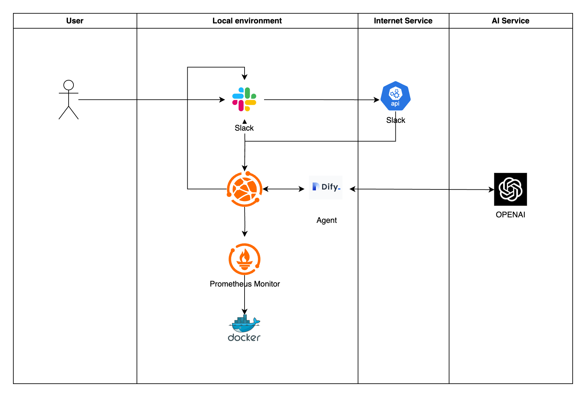
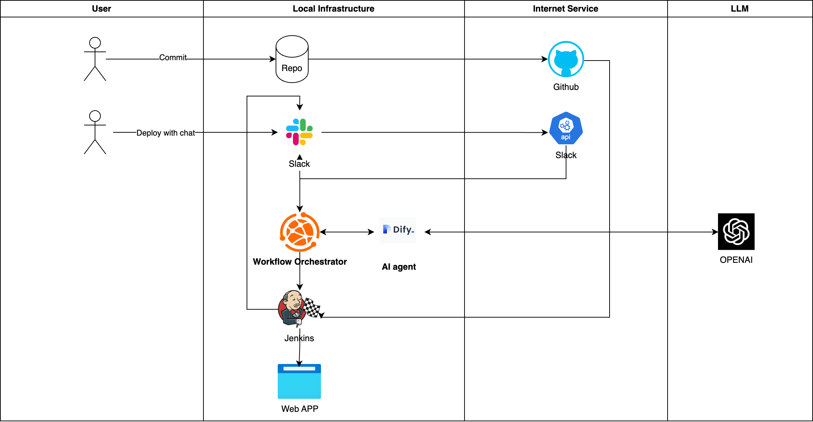

# Introduction

This project aims to develop a ChatOps solution that enables natural language-driven DevOps operations through integration of various tools and Large Language Models (LLMs). The system will solve the problem of complex DevOps operations by providing an intuitive, natural language interface for deployment, monitoring, and system management tasks.

## Problem Statement

DevOps operations often require specialized knowledge and complex command syntax across multiple tools. This creates a high barrier to entry for team members without extensive DevOps experience and slows down operational workflows.

## Project Objectives

1. Simplify DevOps operations through natural language interfaces
2. Reduce the learning curve for new team members
3. Accelerate common deployment and monitoring tasks
4. Create a centralized interface for disparate DevOps tools

# Architecture

The system implements a flexible and extensible AI-driven architecture with these key components:

- **Channels**: Uses Slack as the channel tool
- **API Gateway**: A unified interface for all service communications
- **Orchestration Service**: Coordinates between different services and tools
- **Agent Service**: Core AI processing with extensible modules
- **External Tools**: Integration with enterprise tools (Jenkins, Prometheus, Docker)
- **LLM Support**: Flexible LLM backend support (GPT, Ollama, DeepSeek)
- **Local Data**: Structured storage for logs and knowledge base

## System Diagram

Two user case integration examples:

### a. Monitoring Integration

> Shows how the AI agent integrates with monitoring systems for automated alerting and response

### b. Deployment Integration

> Demonstrates the integration with CI/CD systems for automated deployments

# Key Features

- Natural language-driven deployments
- Multi-language branch deployment support
- Automatic parameter parsing from natural language
- ChatOps interface through Slack
- Real-time metrics monitoring with Prometheus
- Jenkins CI/CD integration
- Modular and extensible architecture

## Example Use Cases

Users can input these natural language commands in Slack:

1. **Deployment**: "Deploy the latest version of the payment service to staging"
2. **Monitoring**: "Show me CPU usage for the authentication service over the last 24 hours"

# Technology Stack

## Infrastructure & Monitoring

- Docker for containerization
- Jenkins for CI/CD automation
- Prometheus for monitoring
- ngrok for external access

## AI & Automation

- Dify for agent service and prompt management
- OpenAI API for LLM capabilities

## Communication & Workflow

- Slack for ChatOps interface
- Flask for API service
- Redis for message queuing
- PostgreSQL for structured data storage

# Project Timeline

this is a general plan for project planning, the details might be adjusted based on real situation

## Week 2-3: Research and Planning

- Research and finalize technologies and programming languages
- Define detailed system architecture
- Create initial project repository and documentation

## Week 4: Infrastructure Setup

- Set up core infrastructure (Docker, Jenkins, Prometheus)
- Configure development environment
- Implement basic CI/CD pipeline

## Week 5: Core Service Development

- Implement basic ChatOps service with Flask
- Create API gateway structure
- Develop initial orchestration service

## Week 6: Communication Integration

- Integrate Slack API
- Implement basic command handling
- Develop message parsing system

## Week 7: AI Integration

- Implement Dify integration
- Develop NLP processing pipeline
- Create initial prompt templates

## Week 8: Deployment Integration

- Develop Jenkins deployment integration
- Create deployment workflow templates
- Implement parameter extraction from natural language

## Week 9: Monitoring Tool Integration

- Implement Prometheus monitoring integration

## Week 10-11: Testing and Refinement

- User acceptance testing
- Documentation finalization

## Week 12: Presentation and Delivery

- Final presentation preparation

# Conclusion

This ChatOps solution represents a significant advancement in DevOps tooling by leveraging natural language processing to simplify complex operations. The project delivers immediate value through streamlined workflows while establishing a foundation for future AI-driven operational enhancements.
