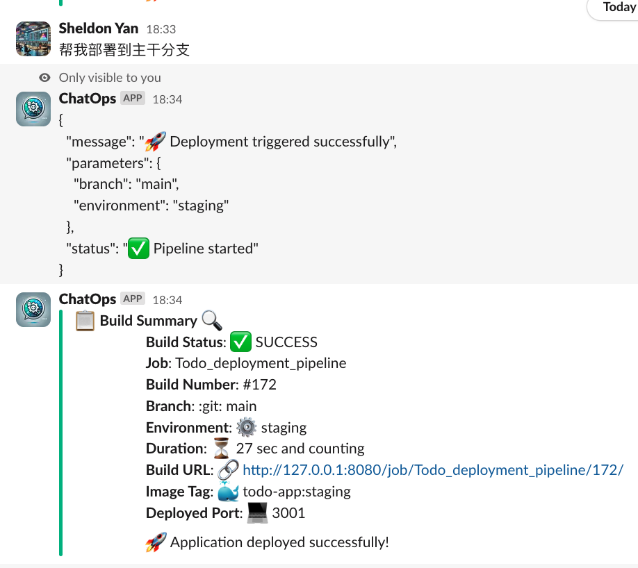

# DevOpsGPT

# **Overview**

This project implements DevOpsGPT/AIOps concepts by integrating various tools and LLMs to enable natural language-driven DevOps operations. It creates a ChatOps solution that allows developers to trigger deployments using natural language commands.

## Tools & Technologies

- **Dify**: Agent service and prompt management
- **Jenkins**: CI/CD automation server
- **Slack**: Communication and ChatOps interface
- **Flask**: Python web framework for API service

- **n8n**: Workflow automation
- **Docker**: Containerization
- **Ray**: Ray is an AI compute engine. Ray consists of a core distributed runtime and a set of AI Libraries for accelerating ML workloads.
- **OpenAI API**: Additional LLM capabilities
- **RAG**: Retrieval Augmented Generation

## **Dmoes**

### **Using natural language to deploy the application in slack chatbot**

- can deploy to different branches with multiple languages
- automatically parse the key parameters from the natural language
  

### Components

- **webhook_for_jenkins (Port 5001)**: Flask service for handling deployment requests
- **Jenkins (Port 8080)**: CI/CD server for running deployments
- **Dify (Default Port)**: Agent service
- **Application (Port 3001)**: Example application service
- **ngrok (Port 4040)**: Tunnel for external access

## Start Jenkins server

- docker run -d --name jenkins -p 8080:8080 -p 50000:50000 jenkins/jenkins:lts
- Set the initial password ' docker exec -it jenkins /bin/bash'
- Create and configure the jenkins pipeline job
- Create a jenkins agent in local
- start agent server in local (have to copy the command from jenkins configuration page !)
- cat /var/jenkins_home/secrets/initialAdminPassword
  
- slack configuration
  

## Start Prometheus server

docker run -d --name prometheus --restart unless-stopped -p 9090:9090 -v $(pwd)/prometheus/prometheus.yml:/etc/prometheus/prometheus.yml prom/prometheus:latest --config.file=/etc/prometheus/prometheus.yml --web.enable-lifecycle

## config the slack

- Create a slack app and get the token
- install the slack app to the workspace and channel
- Configure the URL in the slack app
