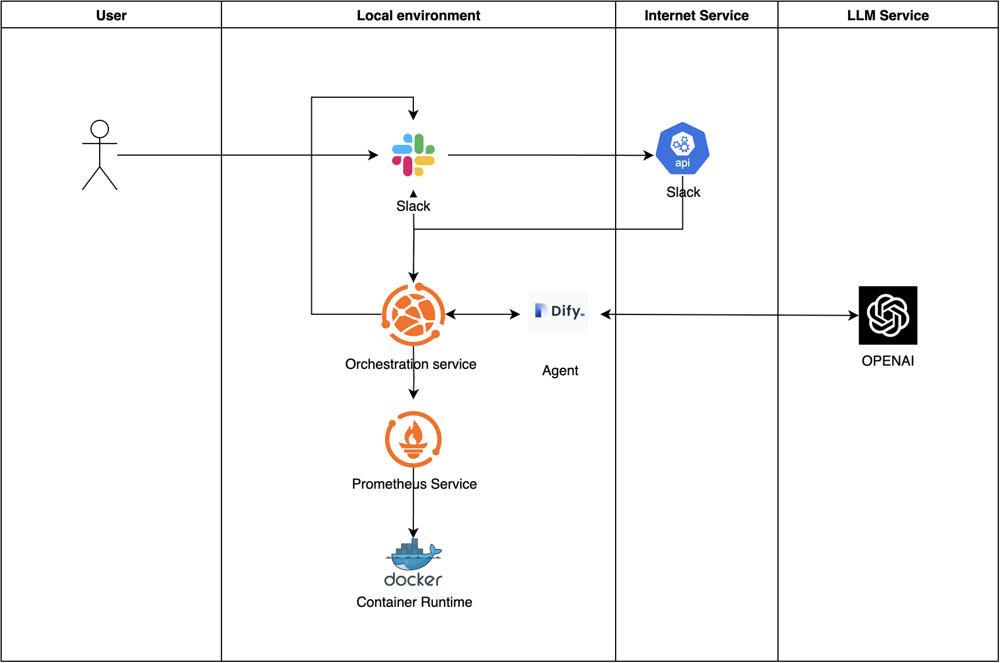
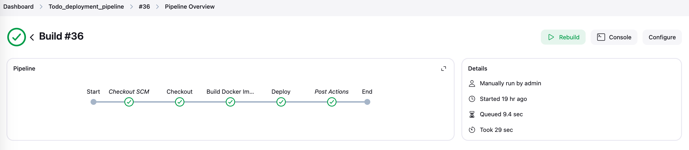

# ChatOps Solution

[](https://www.python.org)

A ChatOps solution that enables natural language-driven DevOps operations through integration of various tools and LLMs.


> The demo shows how to use natural language to trigger deployments and interact with the system through Slack.


> The demo shows how to use natural language to monitor the system and interact with the system through Slack.

## Overview

This project implements ChatOps/AIOps concepts by creating a system that enables developers to trigger deployments using natural language commands. The system integrates various tools and services to provide a seamless ChatOps experience.

**Key Principle**: All services and modules are decoupled and can be replaced with alternatives. For example:

- OpenAI can be replaced with other LLM services
- The agent can be replaced with other agent services
- Monitoring and CI/CD tools can be replaced with alternative solutions

> While the demo runs locally, the system is designed for and supports cloud deployment.

The demo project is available in this repository: [ChatOps-Solution](https://github.com/Danielyan86/DevOpsGPT_Demo)

## Architecture

### AI-Driven DevOps Architecture


The system implements a flexible and extensible AI-driven architecture that can be customized for enterprise needs. Key components include:

- **Channels**: Support multiple communication channels (WeCom, Teams, Slack, Discord) for user interaction
- **API Gateway**: Unified interface for all service communications
- **Orchestration Service**: Coordinates between different services and tools
- **Agent Service**: Core AI processing with extensible modules
- **External Tools**: Integration with enterprise tools (Prometheus, Jira, Jenkins, Docker)
- **LLM Support**: Flexible LLM backend support (GPT, Ollama, HuggingFace Models)
- **Local Data**: Structured storage for logs, knowledge base, and additional data sources

This architecture enables enterprises to:

- Build customized AI agent ecosystems
- Integrate with existing enterprise tools
- Scale and extend functionality through modular design
- Maintain data security with local storage options
- Support multiple LLM backends based on requirements

### Implementation Examples

The following examples demonstrate how this architecture is implemented in practice:

#### 1. AI Agent Integration

We've implemented two main integration patterns:

a. Monitoring Integration


> Shows how the AI agent integrates with monitoring systems for automated alerting and response

b. Deployment Integration


> Demonstrates the integration with CI/CD systems for automated deployments

#### 2. Tool Integration Examples

The system successfully integrates with various enterprise tools:

a. Jenkins CI/CD Pipeline


> Automated deployment pipeline triggered by natural language commands

b. Prometheus Monitoring


> Real-time system metrics and monitoring integration

c. Dify Agent Service


> AI agent management and prompt engineering interface

> Note: These examples showcase specific implementations, but the architecture supports integration with alternative tools based on enterprise requirements.

## Status

- [x] ChatOps service functionality
- [x] Slack integration
- [x] Prometheus monitoring
- [x] Jenkins integration
- [x] Dify integration
- [x] Natural language processing

## Features

- Natural language-driven deployments
- Multi-language branch deployment support
- Automatic parameter parsing from natural language
- Integrated monitoring and observability
- ChatOps interface through Slack
- Real-time metrics monitoring with Prometheus

## Components

### Core Services

| Service         | Port    | Description                                            |
| --------------- | ------- | ------------------------------------------------------ |
| ChatOps Service | 5001    | Core service handling requests and service integration |
| Jenkins         | 8080    | CI/CD server for running deployments                   |
| Dify            | Default | Agent service and prompt management                    |
| Application     | 3001    | Example application service                            |
| ngrok           | 4040    | Tunnel for external access                             |
| Prometheus      | 9090    | Metrics collection and monitoring                      |

### Technology Stack

#### Infrastructure & Monitoring

- **Docker** - Containerization platform
- **Jenkins** - CI/CD automation server
- **Prometheus** - Monitoring platform
- **ngrok** - Tunnel for external access
- **GitHub** - Code hosting platform

#### AI & Automation

- **Dify** - Agent service and prompt management
- **OpenAI API** - LLM capabilities
- **RAG** - Retrieval Augmented Generation

#### Communication & Workflow

- **Slack** - ChatOps interface
- **Flask** - Python web framework for API service

## Setup Guide

### Prerequisites

Before starting, ensure you have:

1. Started the Dify server in Docker
2. Configured the Dify bot
3. Started and configured the Jenkins server
4. Set up the Jenkins server and agent
5. Set up and configured Prometheus monitoring

### Setup Dify

1. Clone the Dify repository:

```bash
git clone https://github.com/langgenius/dify.git
cd dify
```

2. Start Dify using Docker Compose:

```bash
docker compose up -d
```

3. Access the Dify web interface:

   - Open your browser and navigate to `http://localhost`
   - Create a new account or login
   - Go to "Applications" and click "Create New"
   - Create a new bot application

4. Configure the bot:

   - In your bot settings, navigate to the Prompt Engineering section
   - Import and configure the prompts from the `prompts` directory in this repository
   - Save your changes

5. Get the API credentials:

   - Go to API Access section in your bot settings
   - Copy the API Key (this will be your bot token)

6. Set up environment variables:

```bash
# Add this to your .env file or export in your shell
export DIFY_BOT_TOKEN=your_bot_token_here
```

> Note: Make sure Docker and Docker Compose are installed on your system before starting the setup process.

### Jenkins Configuration

1. Start Jenkins server:

```bash
docker run -d --name jenkins -p 8080:8080 -p 50000:50000 jenkins/jenkins:lts
```

2. Get initial admin password:

```bash
docker exec -it jenkins /bin/bash
cat /var/jenkins_home/secrets/initialAdminPassword
```

3. Complete setup steps:
   - Create and configure Jenkins pipeline job
   - Set up Jenkins agent locally
   - Start agent server
   - Configure Slack integration
   - Set up Jenkins token

### Prometheus Setup

1. Create Prometheus configuration

2. Start Prometheus container:

```bash
docker run -d --name prometheus \
  --restart unless-stopped \
  --network monitoring \
  -p 9090:9090 \
  -v $(pwd)/prometheus/prometheus.yml:/etc/prometheus/prometheus.yml \
  prom/prometheus:latest \
  --config.file=/etc/prometheus/prometheus.yml \
  --web.enable-lifecycle
```

3. Configure Docker metrics:

```json
{
  "metrics-addr": "127.0.0.1:9323",
  "experimental": true
}
```

4. Access endpoints:
   - Web UI: http://localhost:9090
   - Metrics: http://localhost:9090/metrics
   - Targets: http://localhost:9090/targets

### Setup ngrok

> Note: ngrok is required for external access as Slack API needs a public URL to send messages to your bot.

1. Download and install ngrok:

2. Authenticate ngrok (first time only):

```bash
ngrok config add-authtoken your_auth_token
```

3. Start ngrok tunnel:

```bash
ngrok http 4040
```

4. Configure webhook URL:
   - Copy the generated ngrok URL (e.g., `https://xxxx.ngrok.io`)
   - Use this URL in your Slack app configuration
   - Keep ngrok running while using the Slack integration

### Slack Configuration

1. Create and Install Slack App:

   - Create a new Slack app
   - Configure subscription with ngrok URL
   - Get the app token
   - Install app to workspace and channel

2. Configure App Settings:
   - Set up Interactivity & Shortcuts
     
   - Configure Event Subscriptions
     

## Demo

### Natural Language Deployment

The system supports deploying applications to different branches with multiple languages. See the demo at the top of this document.
