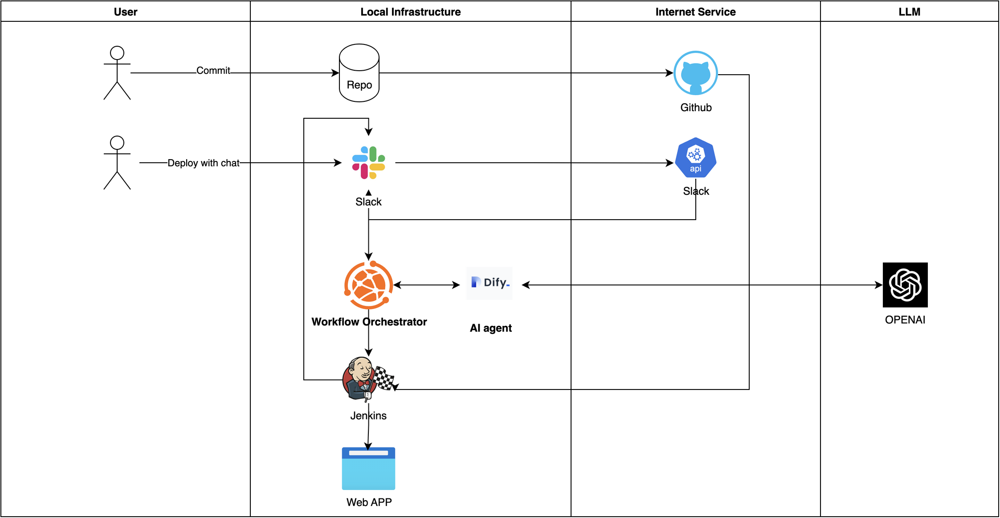

# ChatOps Solution

[](https://www.python.org)

A ChatOps solution that enables natural language-driven DevOps operations through integration of various tools and LLMs.


> The demo shows how to use natural language to trigger deployments and interact with the system through Slack.

## Overview

This project implements ChatOps/AIOps concepts by creating a system that enables developers to trigger deployments using natural language commands. The system integrates various tools and services to provide a seamless ChatOps experience.

**Key Principle**: All services and modules are decoupled and can be replaced with alternatives. For example:

- OpenAI can be replaced with other LLM services
- The agent can be replaced with other agent services
- Monitoring and CI/CD tools can be replaced with alternative solutions

> While the demo runs locally, the system is designed for and supports cloud deployment.

The demo project is available in this repository: [ChatOps-Solution](https://github.com/Danielyan86/DevOpsGPT_Demo)

## Architecture

### High-Level Design

The system consists of two main architectural components:

1. AI Agent and Monitoring Integration
   

2. AI Agent and Deployment Integration
   

> Note: Some implementation details are not shown (e.g., ngrok, Jenkins agent)

## Status

- [x] ChatOps service functionality
- [x] Slack integration
- [x] Prometheus monitoring
- [x] Jenkins integration
- [x] Dify integration
- [x] Natural language processing

## Features

- Natural language-driven deployments
- Multi-language branch deployment support
- Automatic parameter parsing from natural language
- Integrated monitoring and observability
- ChatOps interface through Slack
- Real-time metrics monitoring with Prometheus

## Components

### Core Services

| Service         | Port    | Description                                            |
| --------------- | ------- | ------------------------------------------------------ |
| ChatOps Service | 5001    | Core service handling requests and service integration |
| Jenkins         | 8080    | CI/CD server for running deployments                   |
| Dify            | Default | Agent service and prompt management                    |
| Application     | 3001    | Example application service                            |
| ngrok           | 4040    | Tunnel for external access                             |
| Prometheus      | 9090    | Metrics collection and monitoring                      |

### Technology Stack

#### Infrastructure & Monitoring

- **Docker** - Containerization platform
- **Jenkins** - CI/CD automation server
- **Prometheus** - Monitoring platform
- **ngrok** - Tunnel for external access
- **GitHub** - Code hosting platform

#### AI & Automation

- **Dify** - Agent service and prompt management
- **OpenAI API** - LLM capabilities
- **RAG** - Retrieval Augmented Generation

#### Communication & Workflow

- **Slack** - ChatOps interface
- **Flask** - Python web framework for API service

## Setup Guide

### Prerequisites

Before starting, ensure you have:

1. Started the Dify server in Docker
2. Configured the Dify bot
3. Started and configured the Jenkins server
4. Set up the Jenkins agent
5. Configured Prometheus monitoring

### Jenkins Configuration

1. Start Jenkins server:

```bash
docker run -d --name jenkins -p 8080:8080 -p 50000:50000 jenkins/jenkins:lts
```

2. Get initial admin password:

```bash
docker exec -it jenkins /bin/bash
cat /var/jenkins_home/secrets/initialAdminPassword
```

3. Complete setup steps:
   - Create and configure Jenkins pipeline job
   - Set up Jenkins agent locally
   - Start agent server
   - Configure Slack integration
   - Set up Jenkins token

### Prometheus Setup

1. Create Prometheus configuration

2. Start Prometheus container:

```bash
docker run -d --name prometheus \
  --restart unless-stopped \
  --network monitoring \
  -p 9090:9090 \
  -v $(pwd)/prometheus/prometheus.yml:/etc/prometheus/prometheus.yml \
  prom/prometheus:latest \
  --config.file=/etc/prometheus/prometheus.yml \
  --web.enable-lifecycle
```

3. Configure Docker metrics:

```json
{
  "metrics-addr": "127.0.0.1:9323",
  "experimental": true
}
```

4. Access endpoints:
   - Web UI: http://localhost:9090
   - Metrics: http://localhost:9090/metrics
   - Targets: http://localhost:9090/targets

### Slack Configuration

1. Create and Install Slack App:

   - Create a new Slack app
   - Get the app token
   - Install app to workspace and channel
   - Configure webhook URLs

2. Configure App Settings:

   - Set up Interactivity & Shortcuts
     

   - Configure Event Subscriptions
     

## Demo

### Natural Language Deployment

The system supports deploying applications to different branches with multiple languages. See the demo at the top of this document.
