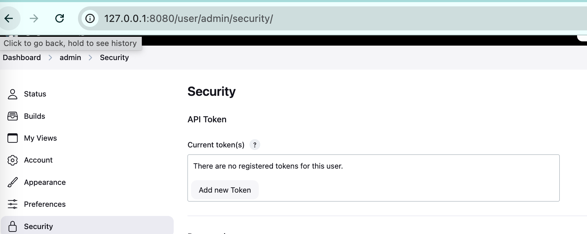

# DevOpsGPT

A ChatOps solution that enables natural language-driven DevOps operations by integrating various tools and LLMs.

## Overview

This project implements DevOpsGPT/AIOps concepts by creating a system that allows developers to trigger deployments using natural language commands. It integrates various tools and services to provide a seamless ChatOps experience.

## Features

- Natural language-driven deployments
- Multi-language branch deployment support
- Automatic parameter parsing from natural language
- Integrated monitoring and observability
- ChatOps interface through Slack
- Real-time metrics monitoring with Prometheus

## Architecture Components

### Core Services

| Service             | Port    | Description                                    |
| ------------------- | ------- | ---------------------------------------------- |
| webhook_for_jenkins | 5001    | Flask service for handling deployment requests |
| Jenkins             | 8080    | CI/CD server for running deployments           |
| Dify                | Default | Agent service and prompt management            |
| Application         | 3001    | Example application service                    |
| ngrok               | 4040    | Tunnel for external access                     |
| Prometheus          | 9090    | Metrics collection and monitoring              |

### Tools & Technologies

#### Infrastructure & Monitoring

- **Docker**: Containerization platform
- **Jenkins**: CI/CD automation server
- **Prometheus**:
  - Real-time metrics collection
  - Application monitoring
  - Container health tracking
  - Custom metrics support
  - Alert management

#### AI & Automation

- **Dify**: Agent service and prompt management
- **Ray**: AI compute engine for ML workloads
- **OpenAI API**: LLM capabilities
- **RAG**: Retrieval Augmented Generation

#### Communication & Workflow

- **Slack**: ChatOps interface
- **n8n**: Workflow automation
- **Flask**: Python web framework for API service

## Setup Guide

### Environment Preparation

1. Start the Dify server in Docker
2. Configure the Dify bot
3. Start and configure the Jenkins server
4. Set up the Jenkins agent
5. Configure Prometheus monitoring

### Jenkins Setup

1. Start Jenkins server:

   ```bash
   docker run -d --name jenkins -p 8080:8080 -p 50000:50000 jenkins/jenkins:lts
   ```

2. Get initial admin password:

   ```bash
   docker exec -it jenkins /bin/bash
   cat /var/jenkins_home/secrets/initialAdminPassword
   ```

3. Configuration steps:
   - Create and configure Jenkins pipeline job
   - Set up Jenkins agent locally
   - Start agent server (copy command from Jenkins configuration page)
   - Configure Slack integration
   - Set up Jenkins token

### Prometheus Setup

1. Create Prometheus configuration:

2. Start Prometheus container:

   ```bash
   docker run -d --name prometheus \
     --restart unless-stopped \
     --network monitoring \
     -p 9090:9090 \
     -v $(pwd)/prometheus/prometheus.yml:/etc/prometheus/prometheus.yml \
     prom/prometheus:latest \
     --config.file=/etc/prometheus/prometheus.yml \
     --web.enable-lifecycle
   ```

3. Configure Docker metrics:

   - Enable Docker metrics in Docker Desktop settings:
     ```json
     {
       "metrics-addr": "127.0.0.1:9323",
       "experimental": true
     }
     ```

4. Access Prometheus:
   - Web UI: http://localhost:9090
   - Metrics endpoint: http://localhost:9090/metrics
   - Target status: http://localhost:9090/targets

### Slack Configuration

1. Create and Install Slack App

   - Create a new Slack app
   - Get the app token
   - Install app to workspace and channel
   - Configure webhook URLs

2. Configure App Settings

   - Set up Interactivity & Shortcuts

     - Enables bot message responses
       

   - Configure Event Subscriptions
     - Enables bot messaging capabilities
       

## Demo

### Natural Language Deployment via Slack

The system supports deploying applications to different branches with multiple languages, automatically parsing key parameters from natural language commands.


### Configuration Screenshots

- Jenkins Agent Configuration
  
- Slack Integration Settings
  
- Jenkins Token Setup
  
