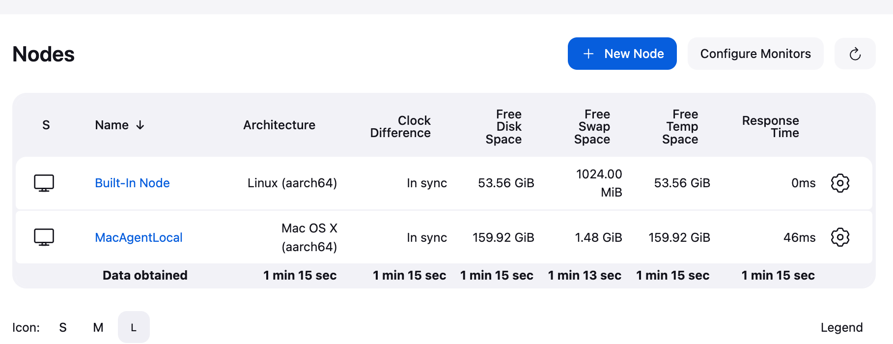
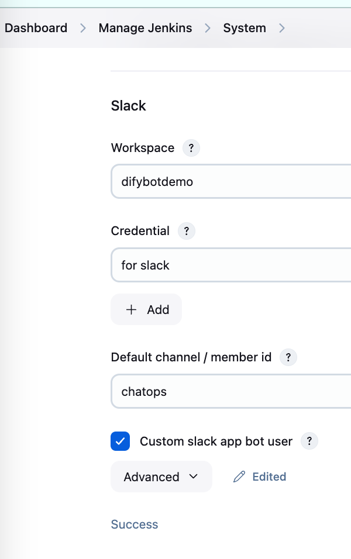
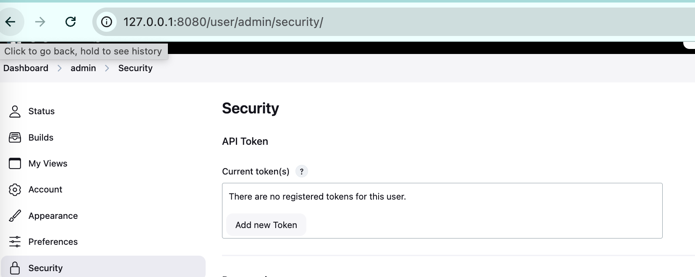

# Jenkins Configuration Guide

## Introduction

The Jenkins main service runs in a local Docker container, with the agent running in the local environment.

## Jenkins Server Setup

1. Start Jenkins with Docker:

```bash
docker run -d --name jenkins \
  -p 8080:8080 -p 50000:50000 \
  -v /Users/sheldon/AI_project_OPS/jenkins_home:/var/jenkins_home \
  -v /Users/sheldon/AI_project_OPS/jenkins_workspace:/var/jenkins_home/workspace \
  jenkins/jenkins:lts
```

2. Get the initial admin password:

```bash
docker exec -it jenkins /bin/bash
jenkins@4dfee92addb0:/$ cat /var/jenkins_home/secrets/initialAdminPassword
```

3. Create a Jenkins job:

   - Create a new pipeline job
   - Configure the job settings
   - Save the configuration

4. Create a Jenkins token:
   - Navigate to User Settings
   - Select API Token section
   - Generate new token
   - Save the token for ChatOps service

## Configuration Steps

### Jenkins Agent Setup

Based on the command from Jenkins page to start the agent:


Run the following command to start the Jenkins agent:

```bash
curl -sO http://127.0.0.1:8080/jnlpJars/agent.jar;java -jar agent.jar \
  -url http://127.0.0.1:8080/ \
  -secret <YOUR_AGENT_SECRET> \
  -name MacAgentLocal \
  -webSocket \
  -workDir "/Users/sheldon/AI_project_OPS/jenkins_agent"
```

Note: Replace `<YOUR_AGENT_SECRET>` with the actual secret token from your Jenkins agent configuration page.

### Slack Integration

Configure Slack token in Jenkins:


### Jenkins Token Configuration

Set up authentication token:


curl -sO http://127.0.0.1:8080/jnlpJars/agent.jar;java -jar agent.jar -url http://127.0.0.1:8080/ -secret XXX -name MacAgentLocal -webSocket -workDir "/Users/sheldon/AI_project_OPS/jenkins_agent"
